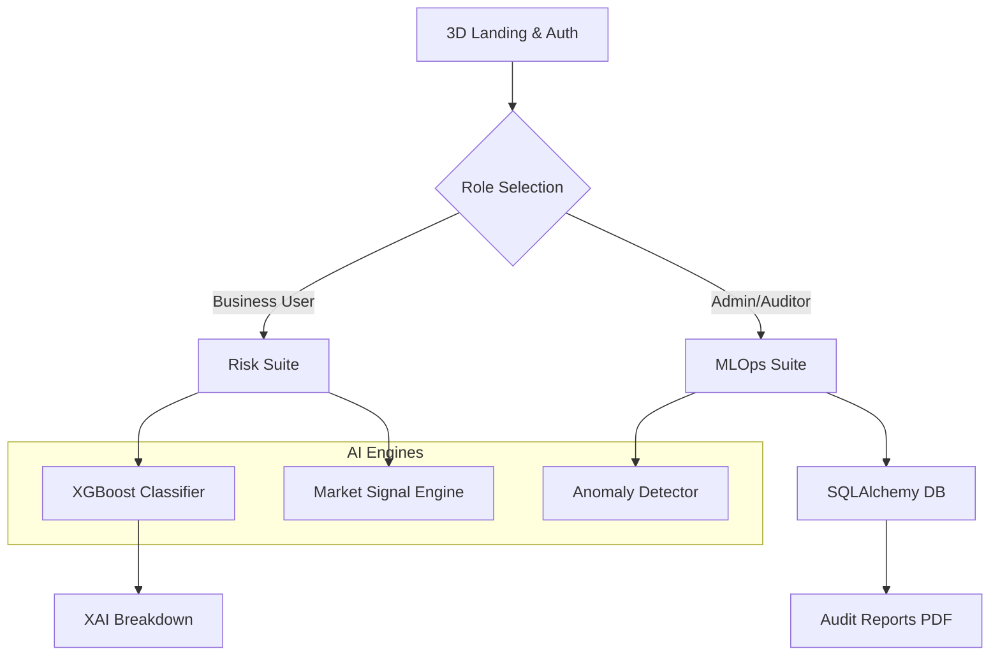

# RiskAI MLOps: Resilient Financial Intelligence Platform


**RiskAI MLOps** is a production-grade, high-fidelity financial ecosystem designed for the next generation of risk management. It combines deep learning, behavioral analytics, and automated MLOps pipelines into a unified, stunning interface.

---

## 🌟 Core Modules

### 1. **Intelligence Hubs**
- **AI Risk Scoring (XAI)**: Generates credit scores with Explainable AI (SHAP-style) feature impact breakdown.
- **Fraud Intelligence**: Real-time transaction monitoring with forensic anomaly analysis.
- **Market AI**: Live stock/crypto tickers with automated BUY/SELL/HOLD signals and rationale.
- **Wealth Simulator**: Predictive analysis of portfolio volatility correlated with personal risk profiles.

### 2. **MLOps & Infrastructure**
- **Automated Pipeline**: 6-stage simulated lifecycle (Ingestion -> Deployment) with live triggers and logs.
- **Model Monitoring**: Real-time observability into model accuracy, MSE, and R2 scores.
- **Strategic Governance**: Admin-level control over risk thresholds and model versioning (A/B Testing).
- **Audit Center**: Immutable SQLite-backed history with professional PDF report generation.

### 3. **AI Interaction**
- **RiskAI Assistant**: A global neural chatbot providing context-aware platform support.
- **EDA Data Room**: Comprehensive Exploratory Data Analysis with correlation heatmaps and feature distributions.
- **Notification Engine**: Global push-alert system for critical risk and market events.

---

## 🛠 Tech Stack

- **Frontend**: React 18, Vite, Framer Motion (Animations), Recharts (Data Viz), Lucide Icons.
- **Backend**: FastAPI (Python), SQLAlchemy (ORM), ReportLab (PDF Engine).
- **Database**: SQLite (Production-ready stateful persistence).
- **DevOps**: Docker, Docker Compose, Multi-stage builds.
- **Aesthetics**: Custom Glassmorphism Design System with Mesh Gradients.

---

## 🚀 Quick Start

### Prerequisites
- Node.js 18+
- Python 3.9+
- Docker (Optional for orchestration)

### Local Development

1. **Backend Setup**:
   ```bash
   cd backend
   pip install -r requirements.txt
   python main.py
   ```

2. **Frontend Setup**:
   ```bash
   cd frontend
   npm install
   npm run dev
   ```

### Docker Deployment
```bash
docker-compose up --build
```

---

## 📐 System Architecture (Mermaid)



---

## 🔐 Security & Governance

- **Multi-step Auth**: Phone/Email OTP, Guest Access, and First-time password setup.
- **RBAC**: Fine-grained Role-Based Access Control for all modules.
- **GDPR Ready**: Optional data anonymization and immutable audit trails.

---

## 📄 License
Distributed under the MIT License. See `LICENSE` for more information.

Developed with ❤️ by the RiskAI Engineering Team.
